# 🌑 ShadowSwap

**MEV-Resistant Intent Settlement Protocol**  
*Powered by Yellow Network State Channels, Uniswap v4 Hooks & ENS Data Records*

[](https://ethglobal.com/events/hackmoney2026)  
[](https://yellow.org/)  
[](https://docs.uniswap.org/)  
[](https://ens.domains/)

---

## ⚡ The Protocol

ShadowSwap crushes front-running and sandwich attacks by decoupling price discovery from settlement.  

Bypass the public mempool: Users express **intents** matched peer-to-peer via **Yellow Network state channels**. Matches settle atomically on a **Uniswap v4 Pool** guarded by a **Hook** that blocks non-solver interactions. Settlement proofs etch into **ENS Text Records** for decentralized, tamper-proof audits.

---

## 🛠️ Stack & Integrations

### 🟡 Yellow Network: Off-Chain Negotiation Layer
Leveraging **Yellow SDK** and **Nitrolite protocol** for gasless, instant intent matching.  
- **Impact:** Off-chain sessions enable seamless, high-frequency trades—settling on-chain only when ready.  
- **Qualifies for Yellow Prize:** Deep integration for trading apps with instant, session-based UX.  
- **Code:** `backend/src/yellow-client.ts`

### 🦄 Uniswap v4: Protected Liquidity Hook
Custom **ShadowHook.sol** enforces privileged execution.  
- **Impact:** `beforeSwap` verifies solver-only access, creating a true "Dark Pool" on public chains.  
- **Qualifies for Uniswap Prizes:** Explores agentic finance (programmatic routing) and privacy DeFi (resilient to extractive attacks). Hooks enhance transparency and composability.  
- **Code:** `contracts/src/ShadowHook.sol`

### 🔷 ENS: Immutable Settlement Proofs
Repurposing **ENS Text Records** as a verification oracle.  
- **Impact:** Post-settlement hashes stored on `shadowswap.eth` for user-verifiable proofs—beyond mere naming.  
- **Qualifies for ENS Prizes:** Creative DeFi use case; stores arbitrary data for audit trails, boosting trust and UX.  
- **Code:** `contracts/src/MockENSResolver.sol`

---

## 🏗️ Architecture Flow

```mermaid
graph TD
    User[User Intent] -->|Private P2P| Solver
    Solver -->|Negotiate| Yellow[🟡 Yellow Network State Channel]
    Yellow -->|Match Confirmed| Solver
    Solver -->|Submit Tx| Router[ShadowRouter.sol]
    Router -->|Unlock| Pool[🦄 Uniswap v4 PoolManager]
    Pool -->|Validate| Hook[🪝 ShadowHook.sol]
    Hook -- Check: isSolver? --> Valid{Yes}
    Valid -->|Swap Executed| Pool
    Solver -->|Record Proof| ENS[🔷 ENS Text Record]
```



---

## 🚀 Live Deployment (Sepolia)

| Component     | Address                                    |
|---------------|--------------------------------------------|
| ShadowHook   | 0xE0dc953A2136a4cb6A9EEB3cbD44296969D14080 |
| ShadowRouter | 0x4D54281B30b6D708A46d5dC64762288aF3748f81 |
| SHADOW Token | 0xf4442339bA89BC5DA1Cf2304Af163D1b82CF0751 |

---

## ⚡ Quick Start

**Prerequisites:** Node 18+, Foundry.

```bash
# 1. Clone & Install
git clone https://github.com/shreyas-sovani/shadowswap.git
cd shadowswap/frontend && npm install
cd ../backend && npm install

# 2. Configure Backend
# Add .env in /backend: SOLVER_PRIVATE_KEY, ALCHEMY_RPC_URL

# 3. Ignite
# Terminal 1: Frontend
npm run dev

# Terminal 2: Solver Backend
npm run server
```

---

## 🧪 Verification

Hook logic battle-tested with Foundry.  

```bash
cd contracts
forge test -vvv
```

Key Passes:  
- `test_RevertIf_PublicUser()`: Blocks MEV bots.  
- `test_Allow_Solver()`: Permits legit intents.  
- `test_ENS_Recording()`: Ensures audit persistence.

<p align="center"><strong>Built with ☕ and 🌑 at HackMoney 2026</strong></p>